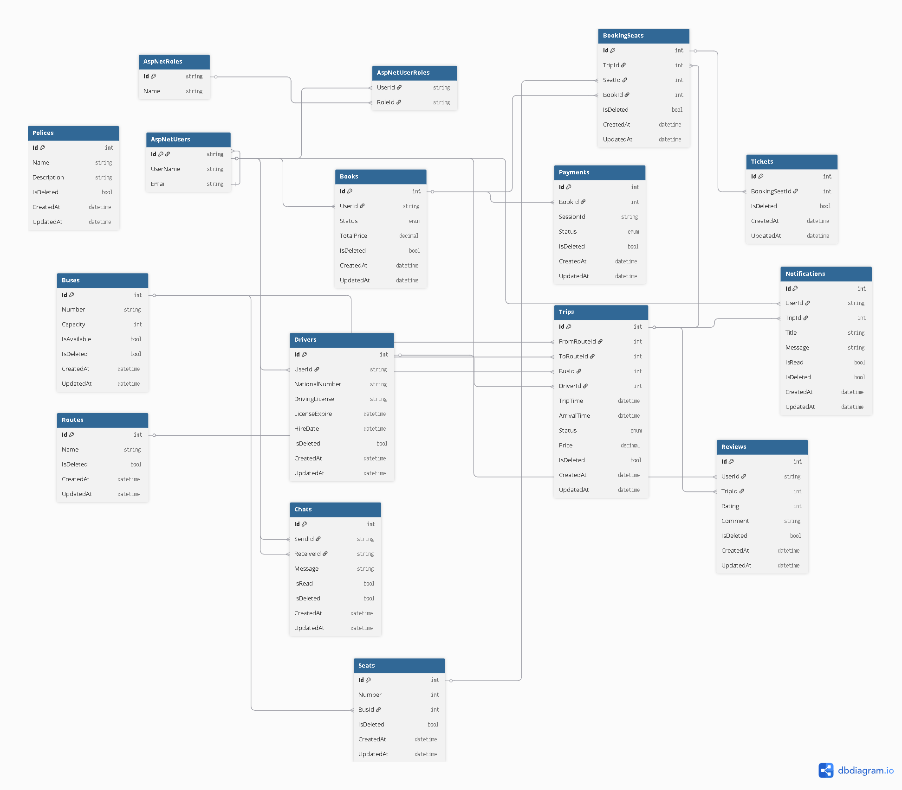

# 🚍 AMBUS - Bus Ticket Booking System API

## 📌 Overview

AMBUS is a scalable and secure Bus Ticket Booking System API built with ASP.NET Core Web API.  
It provides a complete end-to-end solution for managing bus trips, seat reservations, payments, notifications, and administrative operations.

The system follows **Clean Architecture principles** and is designed for high performance, maintainability, and real-world production usage.

---

## 🚀 Key Features

### 👤 Authentication & Users
- User registration and login  
- Role-based authorization (SuperAdmin, Admin, User, Driver)  
- JWT authentication with refresh tokens  
- Email verification and password reset  
- Profile management  

---

### 🚌 Trip Management
- Search trips by origin, destination, and date  
- Display available trips (time, price, seats, bus info)  
- Assign drivers to trips  
- Manage trip schedules (create, update, delete)  

---

### 💺 Seat Booking System
- Interactive seat selection system  
- Multi-seat booking support  
- Prevent double booking of seats  
- Real-time seat availability  

---

### 💳 Payments & Tickets
- Secure online payment integration (Stripe)  
- Automatic ticket generation after payment  
- Email ticket delivery to customers  
- Automatic cancellation on payment failure  

---

### 🔔 Notifications System
- Booking confirmation notifications  
- Trip delay/cancellation alerts  
- Upcoming trip reminders  
- Real-time system notifications  

---

### ⭐ Reviews & Ratings
- Rate drivers and trips  
- Leave feedback and comments  

---

### 🧑‍💼 Admin Dashboard Features
- Manage trips, buses, users, and drivers  
- Assign drivers to trips  
- View bookings and revenue reports  
- Control refund and cancellation policies  
- Manage offers and discounts  
- Generate analytics and reports  

---

### 🤖 AI Integration
- Suggest places near destination using:
  - Google Places API  
  - OpenAI integration  

---

## 📊 Business Rules

### 🎟️ Booking Rules
- User must select:
  - Departure City  
  - Destination City  
  - Trip Date  
  - Number of Seats  
- Reserved seats cannot be double-booked  
- Booking is confirmed only after successful payment  

---

### 💳 Payment Rules
- Only supported payment methods are allowed  
- Failed payments automatically cancel booking  
- Tickets cannot be issued without payment confirmation  

---

### ❌ Cancellation & Refund Rules
- Cancellation allowed before trip start time  
- Refund policy depends on cancellation time  
- No refund after trip has started  

---

## 🎯 System Roles

### 👑 SuperAdmin
- Manage system administrators  
- Control policies and system rules  
- View global reports and analytics  

---

### 🛠️ Admin
- Manage trips, buses, and drivers  
- Handle users and bookings  
- Block/unblock accounts  
- View revenue reports  

---

### 👤 User
- Search and book trips  
- Make payments  
- Cancel bookings  
- View booking history  
- Rate trips and drivers  
- Contact support  

---

### 🚍 Driver
- View assigned trips  
- View passenger list  
- Update trip status (Started / Completed)  

---

## 🏗️ Architecture & Design

The system is built using:

- Clean Architecture  
- CQRS Pattern  
- Repository Pattern  
- Unit of Work Pattern  
- DTO-based design  
- Custom Entity Configurations  
- Soft Delete Pattern  

---

## 🛠️ Technologies Used

- ASP.NET Core Web API  
- Entity Framework Core  
- SQL Server  
- AutoMapper  
- FluentValidation  
- JWT Authentication + Refresh Tokens  
- Serilog Logging  
- Redis / In-Memory Cache  
- Stripe Payment Gateway  
- SignalR (for real-time updates)  
- Email Service  
- Rate Limiting Middleware  

---

## 📦 Advanced Features

- Pagination & Filtering  
- Global Error Handling (RFC Problem Details)  
- Soft Delete Implementation  
- Email Notifications  
- Caching Layer  
- Logging with Serilog  
- Security: JWT + Role-based Authorization  
- Performance Optimization  

---
## 🚀 Future Improvements
- Mobile application (Flutter / React Native)
- Advanced AI trip recommendation engine
- Dynamic pricing system
- Microservices architecture migration
- Push notifications (Firebase)

--- 
## ERD 
 
## ⚙️ Installation

### 1. Clone the repository
```bash
git clone https://github.com/mohkh22/AMBUS

